# Olist Brazilian E-Commerce SQL Analysis

SQL business analysis project using the Olist Brazilian E-Commerce Public Dataset and PostgreSQL.

## Project Overview

This project analyses Brazilian e-commerce data to explore sales performance, customer behaviour, product and seller performance, and delivery outcomes.

The analysis was developed using PostgreSQL and focuses on answering practical business questions through SQL queries, aggregations, joins, subqueries, CTEs, and window functions.

## Dataset

The project uses the **Brazilian E-Commerce Public Dataset by Olist**, which contains approximately 100,000 orders from 2016 to 2018.

The dataset includes information about:

- Customers
- Orders
- Order items
- Payments
- Reviews
- Products
- Sellers
- Geolocation
- Product category translations

The raw CSV files are not included in this repository.

## Business Questions

The analysis explores questions such as:

### Sales Performance
- What is the total revenue?
- How many orders were placed?
- What is the average order value?
- How does revenue change over time?
- Which product categories generate the most revenue?

### Customer Behaviour
- How many unique customers are there?
- How many customers made repeat purchases?
- What proportion of customers are one-time versus repeat customers?
- How does revenue differ between customer types?

### Product & Seller Performance
- Which products generate the most revenue?
- Which sellers generate the most revenue?
- Which sellers have relatively high order volume but low revenue?
- Which products perform best within each category?

### Geographic Performance
- Which Brazilian states generate the most revenue?
- Which states have the highest number of late deliveries?

### Delivery & Customer Experience
- What is the average delivery time?
- How many orders were delivered late?
- How does delivery performance relate to customer review scores?

## SQL Techniques Used

This project demonstrates practical SQL techniques including:

- `SELECT`
- `WHERE`
- `ORDER BY`
- `GROUP BY`
- `HAVING`
- `INNER JOIN`
- `LEFT JOIN`
- Aggregate functions such as `SUM`, `COUNT`, and `AVG`
- `COUNT(DISTINCT ...)`
- `CASE WHEN`
- Date functions
- Subqueries
- Common Table Expressions (CTEs)
- Window functions
- `ROW_NUMBER()`
- Revenue contribution calculations
- Data validation and referential integrity checks

## Database Structure

The PostgreSQL database contains nine main tables.

```mermaid
erDiagram

    CUSTOMERS ||--o{ ORDERS : "has"

    ORDERS ||--o{ ORDER_ITEMS : "contains"
    ORDERS ||--o{ ORDER_PAYMENTS : "has"
    ORDERS ||--o{ ORDER_REVIEWS : "receives"

    PRODUCTS ||--o{ ORDER_ITEMS : "included in"
    SELLERS ||--o{ ORDER_ITEMS : "fulfills"

    CUSTOMERS {
        VARCHAR customer_id PK
        VARCHAR customer_unique_id
        INTEGER customer_zip_code_prefix
        VARCHAR customer_city
        VARCHAR customer_state
    }

    ORDERS {
        VARCHAR order_id PK
        VARCHAR customer_id FK
        VARCHAR order_status
        TIMESTAMP order_purchase_timestamp
        TIMESTAMP order_approved_at
        TIMESTAMP order_delivered_carrier_date
        TIMESTAMP order_delivered_customer_date
        TIMESTAMP order_estimated_delivery_date
    }

    ORDER_ITEMS {
        VARCHAR order_id PK, FK
        INTEGER order_item_id PK
        VARCHAR product_id FK
        VARCHAR seller_id FK
        TIMESTAMP shipping_limit_date
        NUMERIC price
        NUMERIC freight_value
    }

    ORDER_PAYMENTS {
        VARCHAR order_id PK, FK
        INTEGER payment_sequential PK
        VARCHAR payment_type
        INTEGER payment_installments
        NUMERIC payment_value
    }

    ORDER_REVIEWS {
        VARCHAR review_id PK
        VARCHAR order_id PK, FK
        INTEGER review_score
        TEXT review_comment_title
        TEXT review_comment_message
        TIMESTAMP review_creation_date
        TIMESTAMP review_answer_timestamp
    }

    PRODUCTS {
        VARCHAR product_id PK
        VARCHAR product_category_name
        INTEGER product_name_length
        INTEGER product_description_length
        INTEGER product_photos_qty
        INTEGER product_weight_g
        INTEGER product_length_cm
        INTEGER product_height_cm
        INTEGER product_width_cm
    }

    SELLERS {
        VARCHAR seller_id PK
        INTEGER seller_zip_code_prefix
        VARCHAR seller_city
        VARCHAR seller_state
    }

    GEOLOCATION {
        INTEGER geolocation_zip_code_prefix
        NUMERIC geolocation_lat
        NUMERIC geolocation_lng
        VARCHAR geolocation_city
        VARCHAR geolocation_state
    }

    PRODUCT_CATEGORY_TRANSLATION {
        VARCHAR product_category_name PK
        VARCHAR product_category_name_english
    }
```



The database was designed using primary keys and foreign keys where appropriate.

The `order_items` table uses a composite primary key of `(order_id, order_item_id)`.

The `order_payments` table uses a composite primary key of `(order_id, payment_sequential)`.

The `order_reviews` table uses a composite primary key of `(review_id, order_id)` based on the structure of the source data.

The `geolocation` and `product_category_translation` tables are included in the database but do not currently have direct foreign key relationships to other tables.

## Key Findings

## Key Findings

The analysis identified several patterns across sales performance, customer behaviour, seller activity, and delivery outcomes.

### Sales Performance

- The dataset contains **99,441 orders** and generates approximately **13.59M in product revenue**, based on item prices and excluding freight charges.
- The average revenue per order is approximately **137.75**, calculated from product prices across distinct orders.
- Revenue varies substantially across product categories, with a relatively small number of categories contributing a large share of overall product revenue.
- Monthly revenue analysis shows changes in sales activity over the observation period, providing a basis for identifying periods of stronger and weaker commercial performance.

### Customer Behaviour

- The dataset contains **96,096 unique customer identities**.
- **2,997 customer identities** are associated with more than one customer record/order, while **93,099** appear as one-time customers.
- This indicates that the dataset is characterised primarily by one-time purchasing behaviour, highlighting the potential importance of customer retention and repeat-purchase strategies.
- Revenue analysis by customer type shows that one-time customers account for approximately **94.27% of product revenue**, while repeat customers account for approximately **5.73%**.
- Customer-level analysis uses `customer_unique_id` to distinguish customer identities from the `customer_id` records associated with individual orders.

### Delivery Performance

- Among orders with recorded customer delivery dates, **88,649 were delivered on time and 7,827 were delivered after the estimated delivery date**.
- The analysis therefore covers **96,476 delivered orders** with sufficient information to classify delivery performance. Orders without a recorded customer delivery date are excluded from this comparison.
- Average delivery time from purchase to customer delivery was approximately **12.5 days**.
- Late delivery patterns were also examined by customer state to identify geographic differences in delivery performance.

### Customer Reviews and Delivery

- Orders delivered on time received an average review score of approximately **4.29**, compared with **2.57** for orders classified as late.
- This shows a clear **association between delivery performance and review scores within the dataset**.
- The analysis does not establish that late delivery directly causes lower review scores, as other factors may also influence customer satisfaction.

### Product and Category Performance

- Product-level analysis identifies the highest-revenue products and the top revenue-generating products within each product category.
- Category-level analysis compares both revenue contribution and average revenue per order containing each category.
- Product categories were also compared based on their associated average review scores. Because Olist reviews are recorded at the order level, these results should be interpreted as **average review scores for orders associated with a category**, rather than direct product-level satisfaction scores.
- Revenue contribution analysis provides a view of how individual product categories contribute to total product revenue.

### Seller Performance

- Seller-level analysis identifies the highest-revenue sellers based on product sales.
- A separate analysis examines sellers with relatively high order volumes but lower total product revenue, providing a way to identify sellers whose sales volume and revenue generation differ substantially.

### Business Implications

The findings provide several areas for further business investigation:

1. **Customer retention:** The high proportion of one-time customers suggests that repeat-purchase behaviour is an important area for further analysis.
2. **Delivery performance:** The difference in review scores between late and on-time orders indicates that delivery performance is closely associated with the customer experience in this dataset.
3. **Category concentration:** Revenue contribution analysis can help identify categories that represent a substantial proportion of overall sales.
4. **Seller performance:** Comparing order volume with revenue can highlight differences in seller sales profiles and potential opportunities for further investigation.
5. **Geographic performance:** Customer-state and delivery analysis can support further investigation of regional differences in sales and fulfilment outcomes.

### Analytical Notes and Limitations

- **Revenue definition:** Revenue in this project refers to the `price` field from `order_items` and therefore excludes freight charges.
- **Customer definition:** `customer_unique_id` is used when analysing unique customer identities, while `customer_id` represents the customer record associated with an order.
- **Delivery analysis:** On-time and late delivery comparisons include only orders with a recorded customer delivery date.
- **Review analysis:** Olist reviews are associated with orders rather than individual order items. Category-level review analysis therefore uses distinct order-category combinations to avoid artificially duplicating review records when an order contains multiple items.
- **Association vs causation:** Relationships between delivery performance and review scores are observational associations and should not be interpreted as causal effects.
- **Product categories:** The source dataset contains two product categories without English translations. The original category names are retained rather than manually assigning translations.
- **Historical dataset:** The analysis is based on the Olist Brazilian E-Commerce Public Dataset and reflects the period covered by the source data rather than current e-commerce performance.

## Selected Analysis Results

The SQL analysis was used to investigate several business areas, including sales performance, customer behaviour, delivery performance, and customer satisfaction.

### Sales Performance

| Metric | Result |
|---|---:|
| Total orders | 99,441 |
| Unique customers | 96,096 |
| Total product revenue | 13.59M |
| Average order value | 137.75 |

### Customer Behaviour

| Metric | Result |
|---|---:|
| One-time customers | 93,099 |
| Repeat customers | 2,997 |
| One-time customer share | 96.9% |
| Repeat customer share | 3.1% |

### Delivery Performance

| Delivery status | Orders |
|---|---:|
| On time | 88,649 |
| Late | 7,827 |

Average delivery time was approximately **12.5 days** among orders with a recorded customer delivery date.

### Customer Reviews

| Delivery status | Average review score |
|---|---:|
| On time | 4.29 |
| Late | 2.57 |

The results show a substantial difference in average review scores between orders delivered on time and orders delivered late. This represents an observed association in the dataset rather than evidence of a causal relationship.

## Project Structure

```text
olist-ecommerce-sql/
│
├── .gitignore
│
└── sql/
    ├── 01_database_setup.sql
    ├── 02_data_validation.sql
    └── 03_business_analysis.sql
```

### SQL Files

**`01_database_setup.sql`**

Creates the PostgreSQL database tables, primary keys, and foreign key relationships.

**`02_data_validation.sql`**

Contains validation queries used to check record counts, uniqueness, and relationships between tables.

**`03_business_analysis.sql`**

Contains the business analysis queries covering:

- Sales
- Customers
- Products
- Sellers
- Geography
- Delivery performance
- Customer reviews

## Tools

- PostgreSQL
- SQL
- pgAdmin 4
- Git
- GitHub

## Purpose

This project was developed as part of a data analytics portfolio to demonstrate practical SQL skills, relational database analysis, data validation, and the ability to translate business questions into structured analytical queries.
