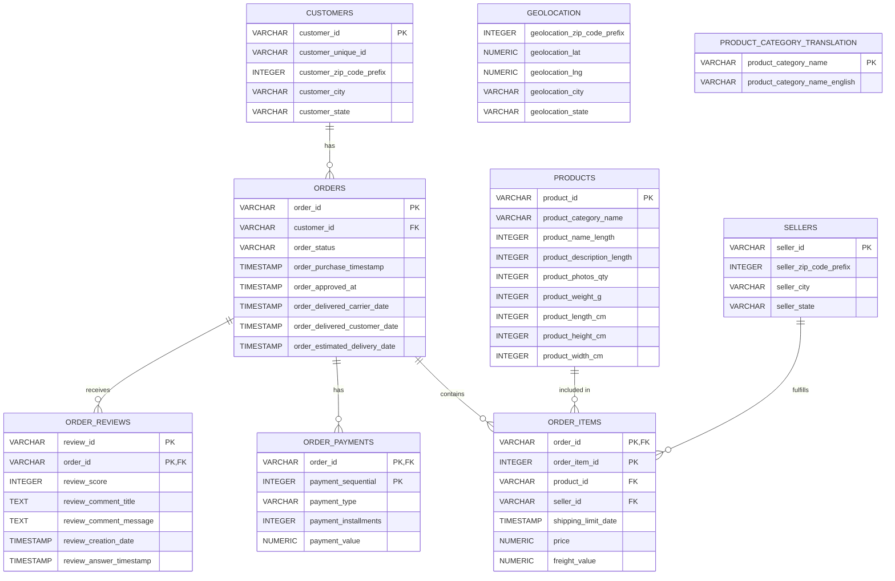

# Olist Brazilian E-Commerce SQL Analysis

SQL business analysis project using the Olist Brazilian E-Commerce Public Dataset and PostgreSQL.

## Project Overview

This project analyses Brazilian e-commerce data to explore sales performance, customer behaviour, product and seller performance, and delivery outcomes.

The analysis was developed using PostgreSQL and focuses on answering practical business questions through SQL queries, aggregations, joins, subqueries, CTEs, and window functions.

## Dataset

The project uses the **Brazilian E-Commerce Public Dataset by Olist**, which contains approximately 100,000 orders from 2016 to 2018.

The dataset includes information about:

- Customers
- Orders
- Order items
- Payments
- Reviews
- Products
- Sellers
- Geolocation
- Product category translations

The raw CSV files are not included in this repository.

## Business Questions

The analysis explores questions such as:

### Sales Performance
- What is the total revenue?
- How many orders were placed?
- What is the average order value?
- How does revenue change over time?
- Which product categories generate the most revenue?

### Customer Behaviour
- How many unique customers are there?
- How many customers made repeat purchases?
- What proportion of customers are one-time versus repeat customers?
- How does revenue differ between customer types?

### Product & Seller Performance
- Which products generate the most revenue?
- Which sellers generate the most revenue?
- Which sellers have relatively high order volume but low revenue?
- Which products perform best within each category?

### Geographic Performance
- Which Brazilian states generate the most revenue?
- Which states have the highest number of late deliveries?

### Delivery & Customer Experience
- What is the average delivery time?
- How many orders were delivered late?
- How does delivery performance relate to customer review scores?

## SQL Techniques Used

This project demonstrates practical SQL techniques including:

- `SELECT`
- `WHERE`
- `ORDER BY`
- `GROUP BY`
- `HAVING`
- `INNER JOIN`
- `LEFT JOIN`
- Aggregate functions such as `SUM`, `COUNT`, and `AVG`
- `COUNT(DISTINCT ...)`
- `CASE WHEN`
- Date functions
- Subqueries
- Common Table Expressions (CTEs)
- Window functions
- `ROW_NUMBER()`
- Revenue contribution calculations
- Data validation and referential integrity checks

## Database Structure

The PostgreSQL database contains nine main tables:

```text
customers
    │
    └── orders
          │
          ├── order_items ── products
          │                 └── sellers
          │
          ├── order_payments
          │
          └── order_reviews

products
    │
    └── product_category_translation

geolocation
```

The database was designed using primary keys and foreign keys where appropriate.

The `order_reviews` table uses a composite primary key of `(review_id, order_id)` based on the structure of the source data.

## Database Structure

The PostgreSQL database contains nine main tables.



The database was designed using primary keys and foreign keys where appropriate.

The `order_items` table uses a composite primary key of `(order_id, order_item_id)`.

The `order_payments` table uses a composite primary key of `(order_id, payment_sequential)`.

The `order_reviews` table uses a composite primary key of `(review_id, order_id)` based on the structure of the source data.

The `geolocation` and `product_category_translation` tables are included in the database but do not currently have direct foreign key relationships to other tables.

## Key Findings

The analysis identified several notable patterns in the dataset.

### Overall Sales

- Total item revenue was approximately **13.59 million**.
- The dataset contains **99,441 orders**.
- There are **96,096 unique customers**.
- Average order value was approximately **137.75**, based on item price.

### Customer Behaviour

- **2,997 unique customer identities** were associated with more than one customer record.
- The analysis separates one-time and repeat customers to examine differences in customer contribution to revenue.

### Product & Seller Performance

Revenue is distributed unevenly across product categories and sellers. The analysis identifies the highest-revenue products, categories, and sellers for further business investigation.

### Delivery Performance

Delivery data was analysed by comparing actual delivery dates with estimated delivery dates. This allows late deliveries to be identified and compared across customer states.

### Customer Reviews

The project also examines the relationship between delivery performance and review scores.

These results describe observed patterns in the dataset and do not establish causal relationships.

## Project Structure

```text
olist-ecommerce-sql/
│
├── .gitignore
│
└── sql/
    ├── 01_database_setup.sql
    ├── 02_data_validation.sql
    └── 03_business_analysis.sql
```

### SQL Files

**`01_database_setup.sql`**

Creates the PostgreSQL database tables, primary keys, and foreign key relationships.

**`02_data_validation.sql`**

Contains validation queries used to check record counts, uniqueness, and relationships between tables.

**`03_business_analysis.sql`**

Contains the business analysis queries covering:

- Sales
- Customers
- Products
- Sellers
- Geography
- Delivery performance
- Customer reviews

## Tools

- PostgreSQL
- SQL
- pgAdmin 4
- Git
- GitHub

## Purpose

This project was developed as part of a data analytics portfolio to demonstrate practical SQL skills, relational database analysis, data validation, and the ability to translate business questions into structured analytical queries.
